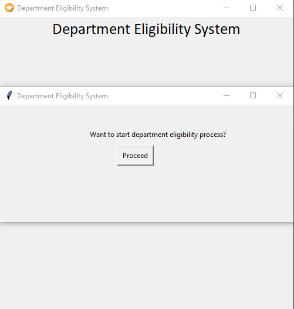
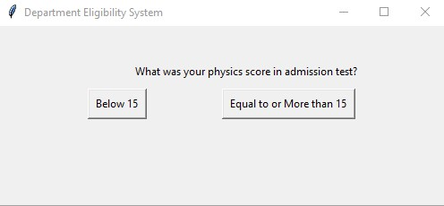
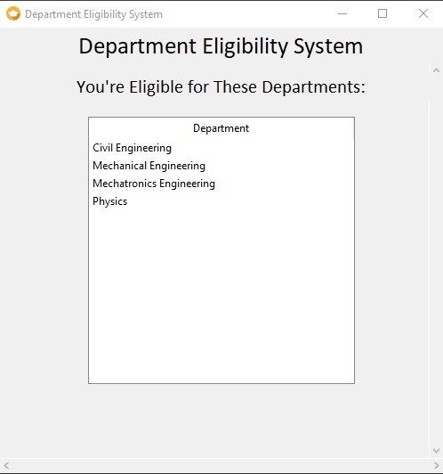
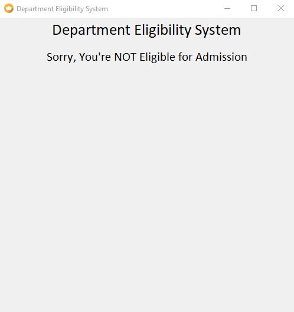

# CSE-3209-Expert-System

A Python-based Expert System for checking university admission eligibity and department allocation, initially completed as a small class project for the course CSE 3209. 

## What it does
- Asks users about their subject-wise scores in admission test.
- Based on some threshold score, the system tries to allocates suitable departments for user.
- If no suitable departments are found, i.e. user's scores are not good enough, admission will be denied

## Inteface
Start screen  
  

Question for user   
  

Final verdict based on user's responses on different questions  
  

If user is not eligible  
  